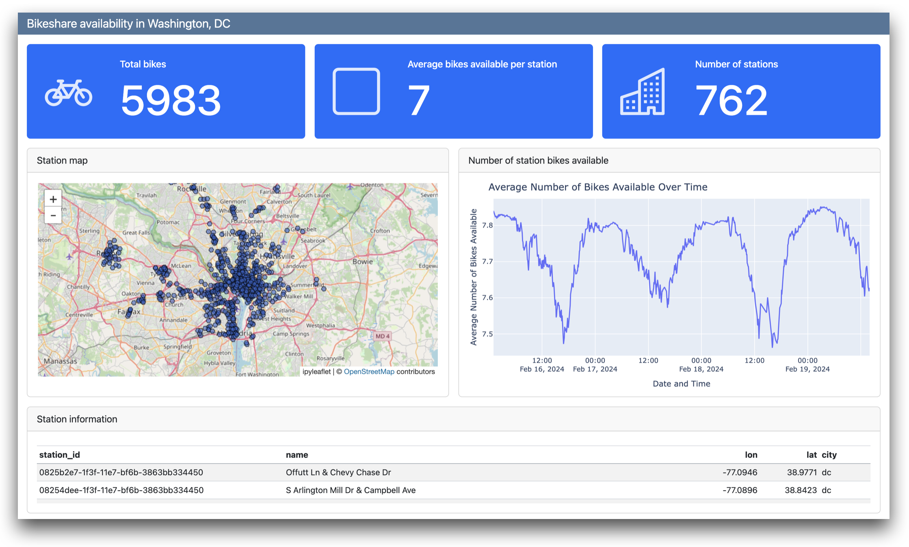
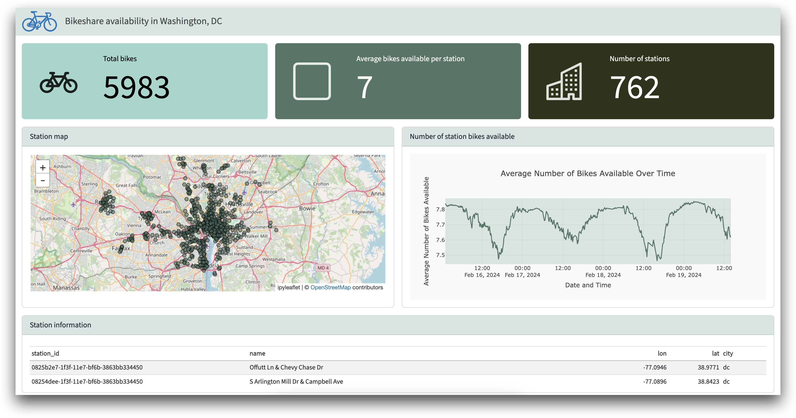
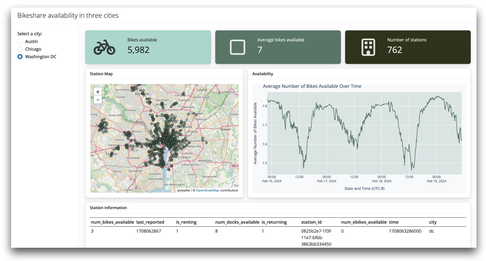

# Use Quarto and Shiny Express to present bikeshare data


# Prompt

The data files linked below contain data recently collected from the
bikeshare programs of three cities:

1.  Austin, TX
2.  Chicago, IL
3.  Washington, DC

- [stations_info.arrow](https://github.com/rstudio/learnmedia-bikeshare/raw/main/data/stations_info.arrow)
  contains the locations and names of bikeshare stations
- [bikes_info.arrow](https://colorado.posit.co/rsc/content/1e885c13-1d6e-470f-b7e4-af3fa5ba3119/stations_arrow.arrow)
  records the number of bikes available at each station over time, as
  well as other variables. A smaller, back up substitute for this file
  is available in the `data` directory.

Use [Quarto](https://quarto.org/) and/or [Shiny
Express](https://shiny.posit.co/py/) to build a polished dashboard or
app that presents this bikeshare data. Your dashboard or app might
answer questions like:

- How does bike capacity change over time?
- Where are the available bikes at a given moment in time?
- What does bikeshare capacity look like across the different cities?

# Templates

This repository contains a set of Quarto and Shiny Express templates,
which all feature the bikeshare data, to help you get started. Each
template comes with a short guide that explains the coding concepts used
with in the tempate.

- [A Basic Quarto
  Dashboard](./quarto-dashboard/bikeshare-dashboard.qmd). ([Guide](./quarto-dashboard/README.md))
  

- [A Quarto Dashboard with styling and
  theming](./quarto-dashboard-theme/bikeshare-theme.qmd). ([Guide](./quarto-dashboard-theme/README.md))
  

- [A Parameterized Quarto
  dashboard](./quarto-dashboard-param/bikeshare-param.qmd) (users can
  supply a parameter at render to reproduce the report for different
  cities). ([Guide](./quarto-dashboard-param/README.md))
  

- [An interactive Shiny Express
  app](./shiny-express-app/app.py). ([Guide](./shiny-express-app/README.md))
  

You can build upon these templates, or just use them to get acquainted
with Quarto and Shiny Express.

If you’d like to see the plots and tables contained in the templates as
a plain jupyter notebook, open [`eda.ipynb` file](eda.ipynb).

# Installation

You’ll need [Quarto 1.5 (pre-release
build)](https://quarto.org/docs/download/prerelease.html/).

To create a python environment pre-provisioned to run the templates,
run:

``` bash
python -m venv venv
source venv/bin/activate
venv/bin/python3 -m pip install -r requirements.txt
```

There is also a `Makefile` in this repository, the `setup` target will
create the venv for you. You can see the other targets with

``` bash
make all
```

Alternatively, you can fork this repo and open it in [GitHub Codespaces](https://docs.github.com/codespaces/).

test
