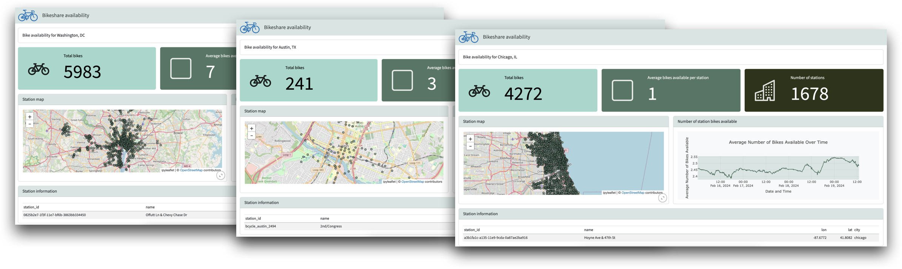

# Parameterize your Quarto dashboard


[This Quarto dashboard
template](https://github.com/rstudio/learnmedia-bikeshare/blob/main/quarto-dashboard-param/bikeshare-param.qmd)
is
[parameterized](https://quarto.org/docs/computations/parameters.html),
so it can be run for different cities.



## What is a parameter?

Parameters turn a dashboard into a function or an algorithm. Users can
supply a parameter for the dashboard to use *when they render it*. In
this example, users can supply a city parameter. As a result, they can
choose to render the same dashboard for different cities.

## Create a parameter

To add a parameter (or multiple parameters) to your dashboard, create a
Python code block with the tag `parameters` at the top of your document:

```` markdown
```{python}
#| tags: [parameters]

```
````

Then, define your parameters as variables inside this code block. The
following code creates a `city` parameter with a default value of
`"chicago"`.

```` markdown
```{python}
#| tags: [parameters]

city = "chicago"
```
````

## Use parameters

Then, use your parameter throughoput your dashboard. Quarto will
overwrite the default value with the user supplied value at render time.

Here, we use our parameter to subset our large dataset to a single city.

```` markdown
```{python}
bike_availability = bikes_all[bikes_all["location"] == city]
```
````

## Change a parameter value when you render

To render your dashboard with different parameter values, run

``` bash
quarto render quarto-dashboard-param/bikeshare-param.qmd -P city:austin
```

Alter the above code to use the file path and parameters of your own
dashboard.

## Going further

Find more ideas in the [next
template](https://github.com/rstudio/learnmedia-bikeshare/tree/main/shiny-express-app),
or visit:

- The [Quarto parameters
  guide](https://quarto.org/docs/computations/parameters.html).
