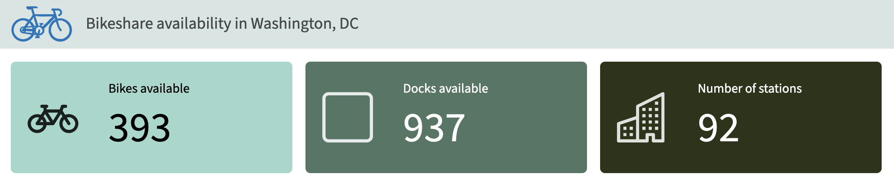

# Theme your Quarto dashboard


[This Quarto dashboard
template](https://github.com/rstudio/learnmedia-bikeshare/blob/main/quarto-dashboard-theme/bikeshare-theme.qmd)
uses a custom theme and features:

1.  Custom colors
2.  Custom fonts
3.  A logo

The dashboard template looks like this when rendered:


## Preset themes

Quarto Dashboards use Bootstrap 5 based theming. You can specify a
different Bootstrap theme using the `theme` option in the YAML header:

``` yaml
title: "Bikeshare Dashboard"
format:
  dashboard:
    theme: cosmo
```

Quarto includes 25 different Bootstrap themes. See the list of available
themes [here](https://quarto.org/docs/dashboards/theming.html#overview).

## Custom themes

You can also create a custom Quarto theme with
[Sass](https://sass-lang.com/). Create a custom Sass file (e.g.,
`custom.scss`) and then provide the file name in the YAML header.

``` yaml
title: "Bikeshare Dashboard"
format:
  dashboard:
    theme: custom.scss
```

If you specify `theme: custom.scss`, your custom theme will inherit from
the default Bootstrap theme. If you want to inherit from a different
Bootstrap theme, supply the name of that theme and your Sass file to
`theme`.

``` yaml
title: "Bikeshare Dashboard"
format:
  dashboard:
    theme:
      - cosmo
      - custom.scss
```

In a Sass file, you can define both
[variables](https://quarto.org/docs/dashboards/theming.html#sass-variables)
and rules. Variables globally control elements like colors and fonts.
Rules define more fine-grained behavior. You can see a list of possible
Sass variables for Quarto dashboards
[here](https://quarto.org/docs/dashboards/theming.html#sass-variables).

Sass rules are typical CSS rules, just like you would see in a CSS file.

Take a look at the dashboard’s
[`custom.scss`](https://github.com/rstudio/learnmedia-bikeshare/blob/main/quarto-dashboard-theme/custom.scss)
file to see an example of how to specify Sass rules and variables.

## Add a Logo

To add a logo to the upper-left corner of the dashboard navbar, use the
`logo` YAML field:

``` yaml
title: "Bikeshare Dashboard"
format:
  dashboard:
    theme:
      - cosmo
      - custom.scss
    logo: images/logo.png
```



## Tip: remember your plots and tables

To make a theme look even more impressive, remember to incorporate them
colors and fonts within the plots and tables that appear in your
dashboard.

## Render the dashboard

You can render the dashboard by clicking the Preview button at the top
of your `.qmd` file in VS Code, or with

``` bash
quarto render quarto-dashboard-theme/bikeshare-theme.qmd # The path to your file
```

Learn more about render options, including how to render Jupyter
notebooks
[here](https://quarto.org/docs/computations/python.html#rendering).

## Going further

Find more ideas in the [next
template](https://github.com/rstudio/learnmedia-bikeshare/blob/main/quarto-dashboard-param).
