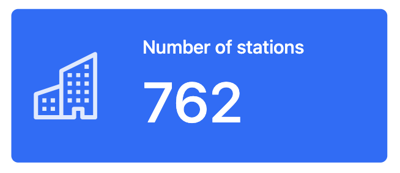

# Quarto Dashboards


Quarto provides an easy way to create attractive dashboards with Python,
R, Julia, and Observable.

- You’ll need [Quarto 1.5 (pre-release
  build)](https://quarto.org/docs/download/prerelease.html/).

- If you are using VS Code, you will also want to install the helpful
  [VS Code quarto
  extension](https://marketplace.visualstudio.com/items?itemName=quarto.quarto).

This dashboard template looks like this when rendered:


## Make a Dashboard

To create a Quarto dashboard:

1.  Open a Quarto document (`.qmd`) in your favorite editor
2.  Edit the YAML header to include `format: dashboard`.

``` yaml
title: "Dashboard title"
format: dashboard
```

## Add content

Add content to your dashboard in Python code blocks. Quarto will display
the output of each chunk—but not the code that creates the output—as a
card in your dashboard.

Place content in separate chunks to make separate cards.

Use the `#|` comment to provide the card with a `title:`.

For example, within the template, we make a card that contains a plot.

```` markdown
```{python}
#| title: Number of station bikes available
show_trend(bikes = bikes)
```
````

And, we make another card that contains a table.

```` markdown
```{python}
#| title: Station information
Markdown(stations.to_markdown(index = False))
```
````

## Define Rows and columns

Use the markdown headers `## Row` and `### Column` to separate your
cards into rows and columns.

By default, each new chunk in a row will appear in its own column. For
example, the following dashboard defines two rows, and the second row
has two columns:

```` markdown
## Row

```{python}
# Code
```

## Row

```{python}
# Code
```

```{python}
# Code
```
````

Need more control? Discover all of Quarto’s dashboard layout options
[here](https://quarto.org/docs/dashboards/layout.html).

## Make Value Boxes

To add a [value
box](https://quarto.org/docs/dashboards/data-display.html#value-boxes),
use a `#| content:` to set the chunk’s content parameter to `valuebox`.
Then supply a `dict()` that contains an icon (optional), color
(optional), and value for the box.

```` markdown
```{python}
#| content: valuebox
#| title: "Number of stations"
dict(
  icon = "buildings",
  color = "blue",
  value = stations['station_id'].nunique()
)
```
````



## Render the dashboard

You can render the dashboard by clicking the Preview button at the top
of your `.qmd` file in VS Code, or with

``` bash
quarto render quarto-dashboard/bikeshare-dashboard.qmd # The path to your file
```

Learn more about render options, including how to render Jupyter
notebooks
[here](https://quarto.org/docs/computations/python.html#rendering).

## Going further

Find more ideas in the [next
template](https://github.com/rstudio/learnmedia-bikeshare/tree/main/quarto-dashboard-theme),
or visit:

- [Overview and examples](https://quarto.org/docs/dashboards/)
- [Dashboard layout](https://quarto.org/docs/dashboards/layout.html)
- [Data display](https://quarto.org/docs/dashboards/data-display.html)
